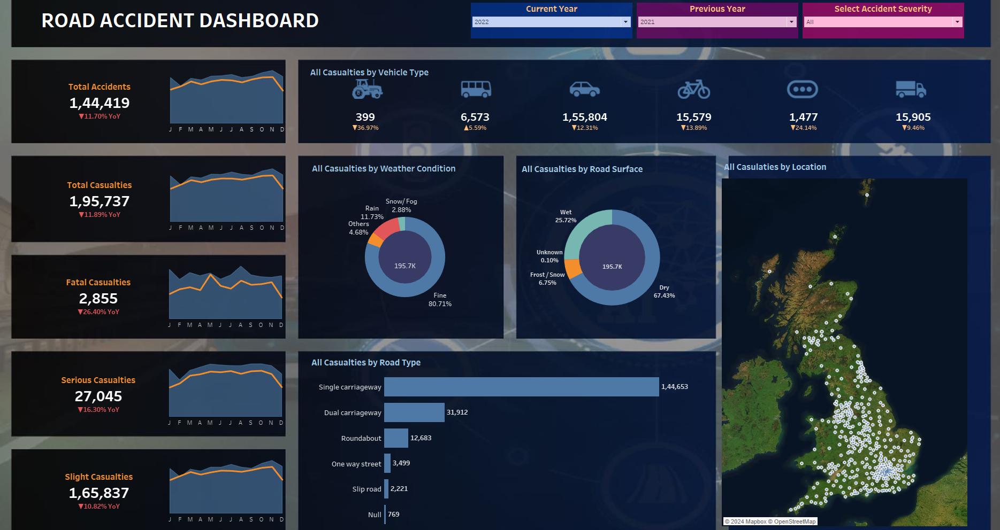

# Road Accident Analysis Dashboard

This repository contains a Tableau dashboard for visualizing and analyzing accident data. The dashboard provides insights into accident trends, severity levels, geographical distribution, and other factors, aiding stakeholders in identifying risk areas and making data-driven decisions to improve road safety.

## Table of Contents

- [Overview](#overview)
- [Features](#features)
- [Data Source](#data-source)
- [Setup and Usage](#setup-and-usage)
- [Screenshots](#screenshots)
- [Contributing](#contributing)

## Overview

The Accident Analysis Dashboard is built using Tableau and provides an interactive interface for exploring various aspects of accident data. This tool is beneficial for safety analysts, urban planners, and policymakers looking to reduce accidents by understanding patterns and high-risk factors.

## Screenshots

## Features

- **Time-Based Analysis**: View accident occurrences over time, enabling trend analysis by month, day, or time.
- **Geographic Mapping**: Visualize accident hotspots on an interactive map, helping to identify high-risk locations.
- **Severity Insights**: Analyze accidents based on severity to understand which factors might contribute to more severe incidents.
- **Filter Options**: Dynamic filters for variables like weather, location, and time of day, allowing users to examine specific conditions.

## Data Source

This dashboard uses public accident data (adjust based on your actual data source). Ensure compliance with any terms associated with the dataset and provide necessary attributions if required.

## Setup and Usage

1. **Download the Dashboard File**: Download the `.twbx` Tableau workbook file from this repository.
2. **Open in Tableau**: Open the file using [Tableau Desktop](https://www.tableau.com/products/desktop) or [Tableau Public](https://public.tableau.com/).
3. **Interact with the Dashboard**: Utilize the filters and interactive elements within the dashboard to explore various accident data insights.

   > **Note**: For the best experience, view the dashboard on a desktop or larger screen.

> Save a screenshot of the dashboard as `assets/accident_dashboard.png` and include it in this repository to display here.

## Contributing

Contributions are welcome! If you'd like to enhance the dashboard or add new features, please fork this repository, create a new branch with your changes, and submit a pull request.
